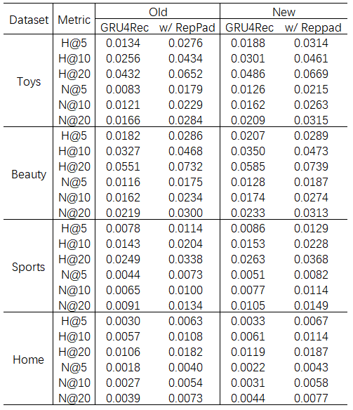
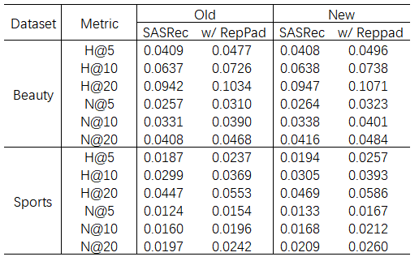

## RepPad-ENS
Official source code for paper: [Why is Repeated Padding Effective for Sequential Recommendation?]()

We provide implementations of the two most representative sequential recommendation models, GRU4Rec and SASRec.

## Run the Code

Go to the `src` folder in the `SASRec` or `GRU4Rec` directory, then run the following commands.

GRU4Rec:
```
python main.py --data_name=Toys_and_Games --aug_type=1 --model_idx=1 --neg_seq_num=5
python main.py --data_name=Beauty --aug_type=1 --model_idx=1 --neg_seq_num=5
python main.py --data_name=Sports_and_Outdoors --aug_type=1 --model_idx=1 --neg_seq_num=2
python main.py --data_name=Yelp --aug_type=1 --model_idx=1 --neg_seq_num=6
python main.py --data_name=Home --aug_type=1 --model_idx=1 --neg_seq_num=4
```

SASRec:
```
python main.py --data_name=Toys_and_Games --aug_type=1 --model_idx=1 --neg_seq_num=4
python main.py --data_name=Beauty --aug_type=1 --model_idx=1 --neg_seq_num=4
python main.py --data_name=Sports_and_Outdoors --aug_type=1 --model_idx=1 --neg_seq_num=3
python main.py --data_name=Yelp --aug_type=1 --model_idx=1 --neg_seq_num=5
python main.py --data_name=Home --aug_type=1 --model_idx=1 --neg_seq_num=3
```

## Large-Scale Datasets

We verified the effectiveness of our method on two large-scale datasets. 
Place the pkl data file in the `data` directory. Go to the `src` folder in the `SASRec` or `GRU4Rec` directory, then run the following commands.

GRU4Rec:
```
python main.py --data_name=Yelp-L --aug_type=1 --model_idx=1 --neg_seq_num=6
python main.py --data_name=YooChoose --aug_type=1 --model_idx=1 --neg_seq_num=4
```

SASRec:
```
python main.py --data_name=Yelp-L --aug_type=1 --model_idx=1 --neg_seq_num=5
python main.py --data_name=YooChoose --aug_type=1 --model_idx=1 --neg_seq_num=4
```


## Data Processing

We provided data processing code under the `Data Processing` directory, which you can use to process your own dataset.


## Inconsistent Results

Since we maintain the same experimental environment and hyperparameter settings with RepPad, for the base model and the recommended performance of RepPad, we directly extract the results from the original paper. 
However, we found during our experiments that some of the training configurations provided in the original paper suffer from incomplete loss convergence. 

We increase the number of epochs to ensure that the loss converges. As a result, a small portion of the experimental results in this paper are inconsistent with those in the RepPad paper. 
Specific cases of inconsistency include: 1) The GRU4Rec base model and GRU4Rec-RepPad on the Toys, Beauty, Sports, and Home datasets; 2) The SASRec base model and SASRec-RepPad on the Beauty and Sports datasets. 
The -RepPad denotes adding RepPad to the corresponding base model. We summarized the inconsistent results in the tables below.

GRU4Rec:



SASRec:



## Acknowledgement
 - Training pipeline is implemented based on [CoSeRec](https://github.com/YChen1993/CoSeRec).
 - SASRec model are implemented based on [RecBole](https://github.com/RUCAIBox/RecBole). 

Thanks them for providing efficient implementation.


## Reference

Please cite our paper if you use this code.
```

```
